

  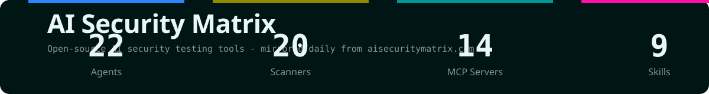

## What this is

A curated directory of **AI security testing tools** — LLM red-teaming platforms, agentic pentest frameworks, security-focused MCP servers, and skill packs.

**What sets it apart: every tool is audited for what it does to your machine before you run it.**
The repository syncs daily from [aisecuritymatrix.com](https://aisecuritymatrix.com) and flags whether each project asks for root, reads `~/.aws` or `~/.ssh`, installs software, or calls endpoints it does not own.

| Entry point | What you get |
|:---|:---|
| **[Browse online →](https://gandli.github.io/ai-security-matrix/)** | Search, sort, and filter by category and testing scope (dark / light theme) |
| **[Category index →](#categories)** | Enter by category and read detail pages for all 65 tools |
| **[Structured data →](tools.json)** | Consume `tools.json` directly — stars, bundled tools, and safety checks |

## Pre-run risk audit

Every entry answers the same set of questions. Across all 65 tools:

| Flag | Meaning | Tools |
|:---|:---|:---:|
| `root` | Asks for root / sudo | `44` |
| `credentials` | Reads credential paths (`~/.aws`, `~/.ssh`, …) | `28` |
| `installs` | Installs software on your host | `34` |
| `calls out` | Calls endpoints the project does not own | `13` |
| `opaque` | Contains long unreadable encoded blobs | `6` |
| `binaries` | Ships compiled binaries you did not build | `4` |

> These flags are not a verdict. They tell you what to expect before you `git clone`.

## Screenshots

**English** — dark / light

| Home | Category | Tool detail |
|:---:|:---:|:---:|
| [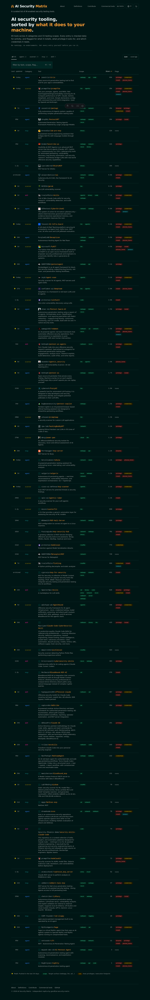](https://gandli.github.io/ai-security-matrix/) | 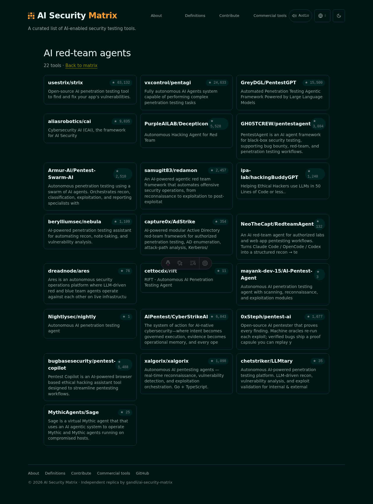 | 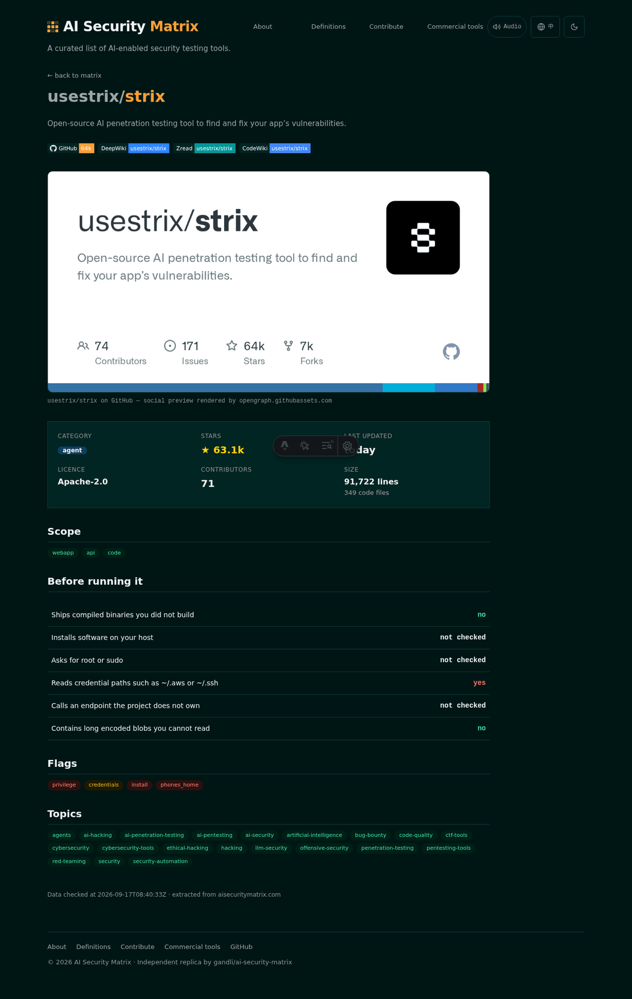 |
| 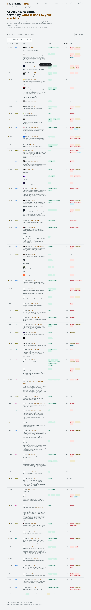 | 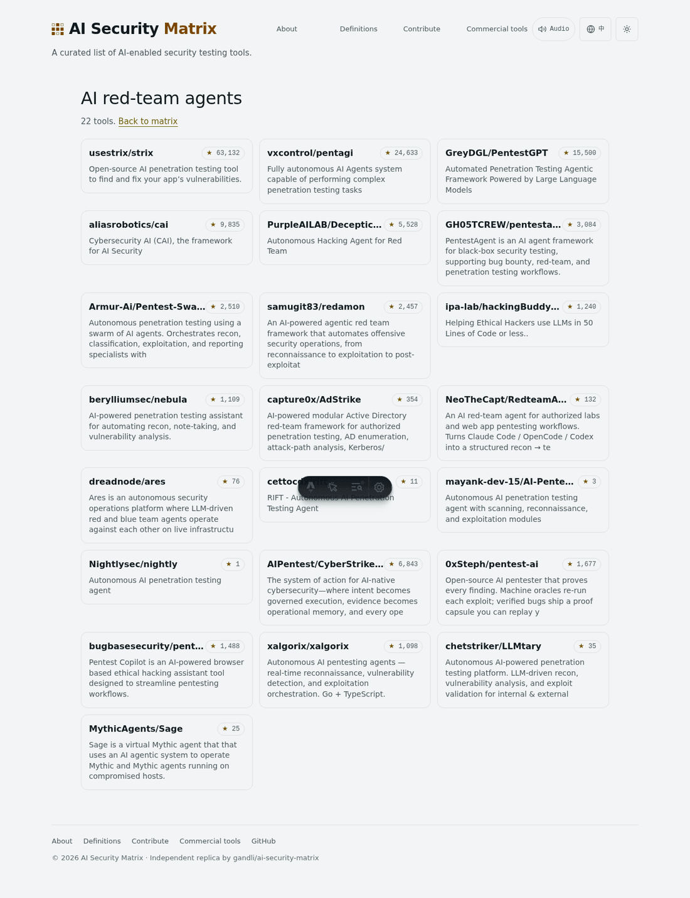 | 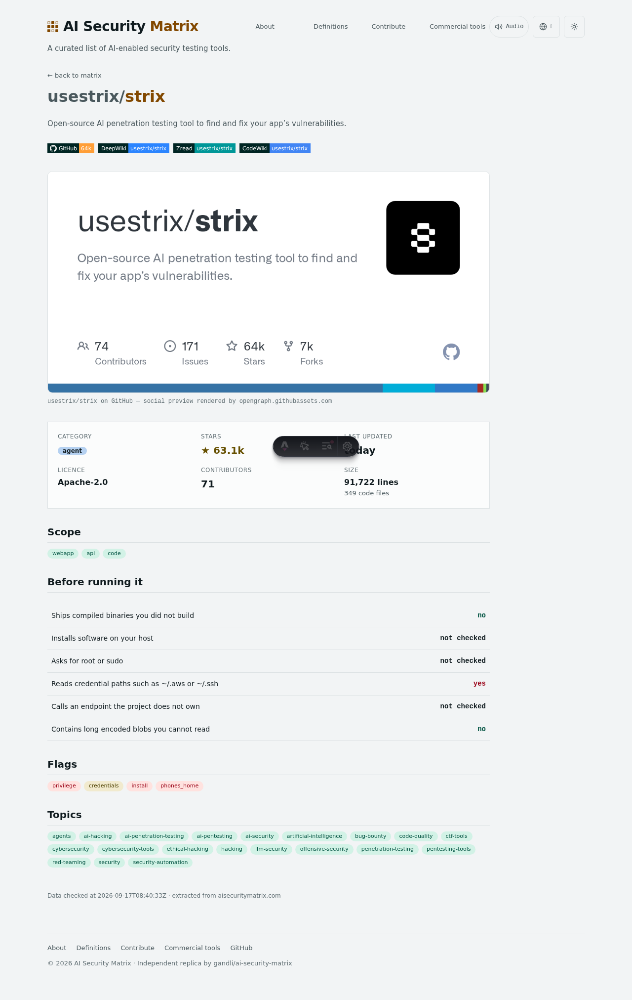 |

**中文** — 暗色主题

| 首页 | 标签索引 | 工具详情 |
|:---:|:---:|:---:|
| 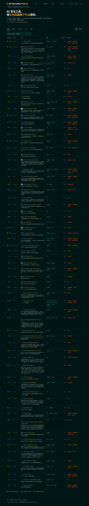 | 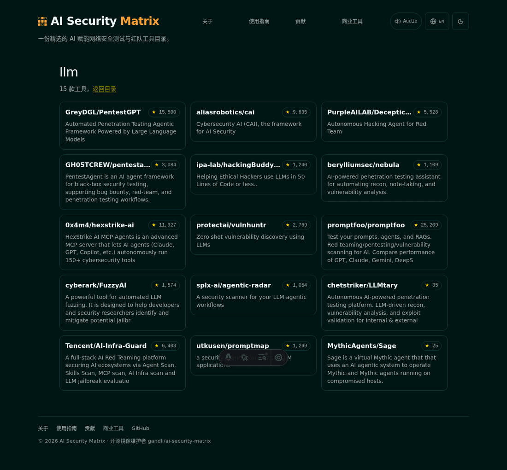 | 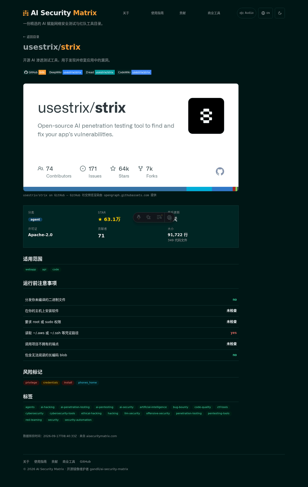 |

**风险标记索引**

| Flag index (dark) | Topic index (dark) |
|:---:|:---:|
| 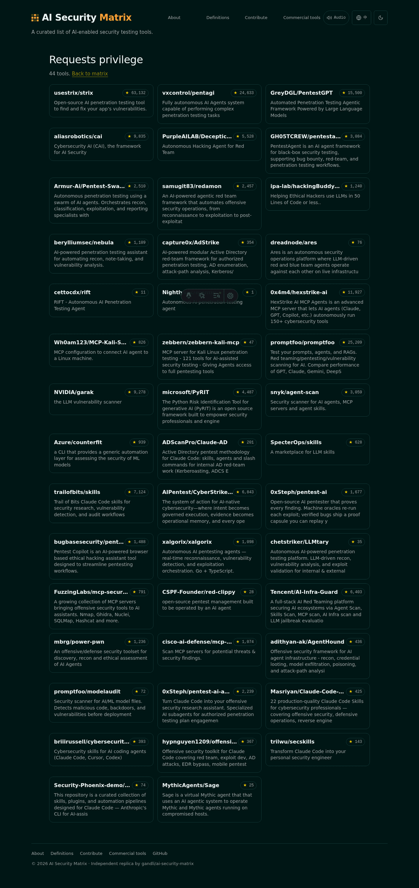 | 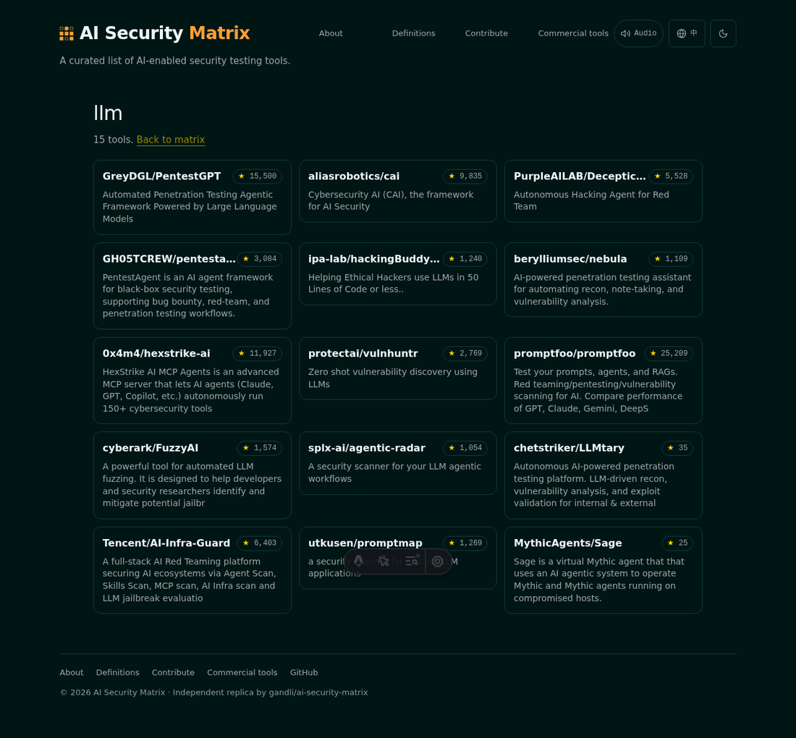 |

Captured with Playwright across both languages and both themes.

  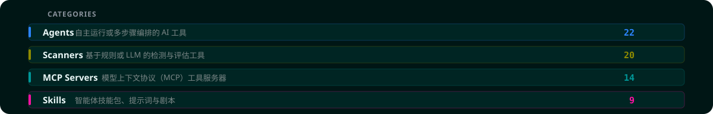

## Categories

| Category | Count | Purpose | Directory |
|:---|:---:|:---|:---|
| **Agents** (`agent`) | `22` | Autonomous / multi-step AI orchestration | [Browse →](tools/agents/) |
| **Scanners** (`scanner`) | `20` | Rule / LLM-assisted detection & evaluation | [Browse →](tools/scanners/) |
| **MCP Servers** (`mcp`) | `14` | Model Context Protocol tool servers | [Browse →](tools/mcp-servers/) |
| **Skills** (`skill`) | `9` | Agent skill bundles, prompts & playbooks | [Browse →](tools/skills/) |

## Data files

- [`tools.json`](tools.json) — all 65 tools with stars, bundled tools, licence, and pre-run safety checks
- [`translations.json`](translations.json) — curated bilingual translation dictionary
- [`scripts/scrape.py`](scripts/scrape.py) — the scraper that generates this README

---

Original catalogue maintained at <a href="https://aisecuritymatrix.com">aisecuritymatrix.com</a> · Independent community mirror

