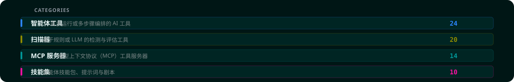

  

> **AI 安全矩阵** 是一份精选的开源 AI 安全测试工具清单，涵盖 LLM 红队平台、智能体化渗透测试系统，以及面向安全领域的模型上下文协议（MCP）服务器。
>
> 镜像自 [aisecuritymatrix.com](https://aisecuritymatrix.com) · 本页面仅作分类索引，每个工具的详情见对应目录下的 `*.zh.md`。

  

## 分类导航

| 类别 | 数量 | 定位 | 目录入口 |
|:---|:---:|:---|:---|
| **智能体工具** (`agent`) | `24` | 自主运行或多步骤编排的 AI 工具 | [进入目录 →](tools/agents/) |
| **扫描器** (`scanner`) | `20` | 基于规则或 LLM 的检测与评估工具 | [进入目录 →](tools/scanners/) |
| **MCP 服务器** (`mcp`) | `14` | 模型上下文协议（MCP）工具服务器 | [进入目录 →](tools/mcp-servers/) |
| **技能集** (`skill`) | `10` | 智能体技能包、提示词与剧本 | [进入目录 →](tools/skills/) |

## 结构化数据

- [`tools.json`](tools.json) — 全部项目的 Stars、内置工具与运行前安全检查（root / 凭据读取 / 外部请求）
- [`translations.json`](translations.json) — 人工维护的双语翻译词条库

---

原始数据版权归 <a href="https://aisecuritymatrix.com">aisecuritymatrix.com</a> 所有 · 本仓库为社区自主同步的中英双语镜像
